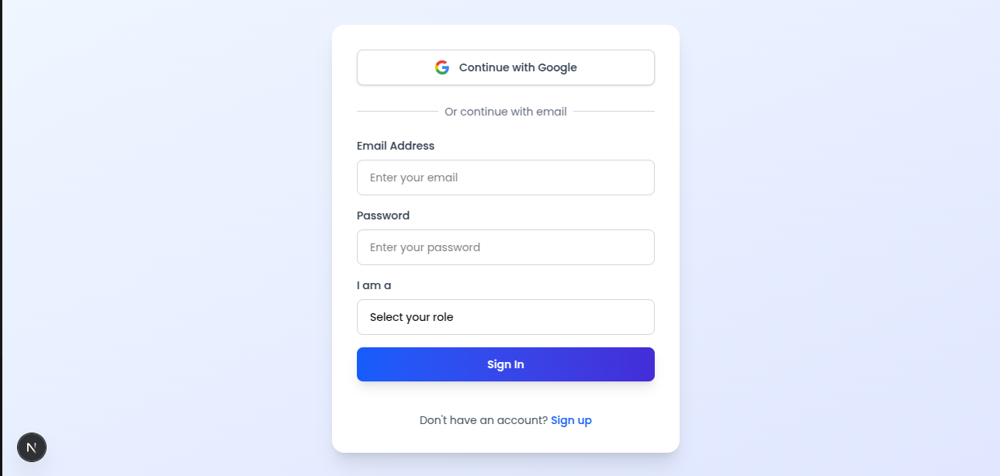
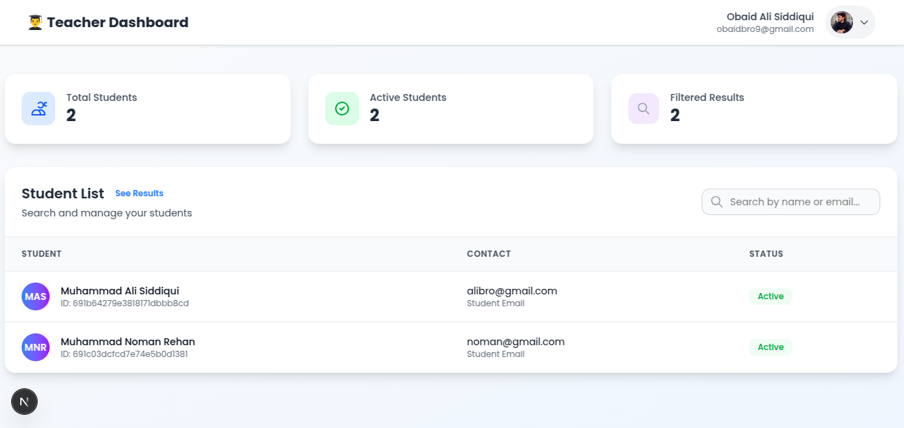
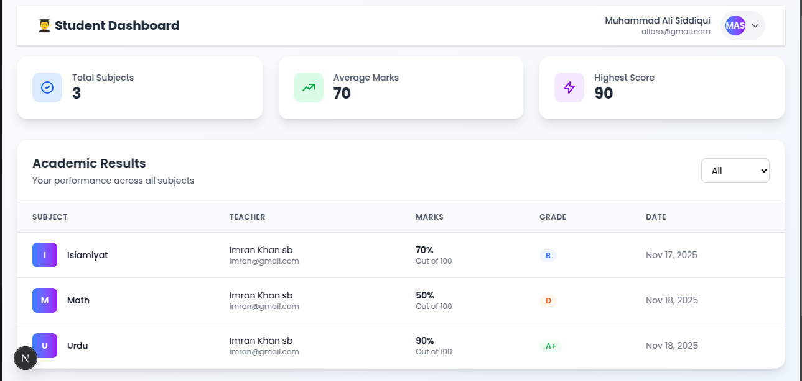

<div align="center">
    <h1><i>MINI LMS PORTAL 🔐</i></h1>
    <p align="center">
        <p><i>Role-Based LMS | Teacher & Student Dashboards</i></p>
    </p>

A full-stack Learning Management System built with Next.js, Express, and MongoDB featuring role-based access, Google OAuth, and result management. 

</div>

## _Key Features_ :

- Role-based Authentication (Teacher/Student)
- Google OAuth Integration
- Teacher Dashboard - Manage students and results
- Student Dashboard - View results and profile
- Protected Routes with JWT authentication
- Responsive Design with Tailwind CSS

## _Tech Stack_ :

- Frontend: Next.js 14, Tailwind CSS, React
- Backend: Node.js, Express, Passport.js
- Database: MongoDB with Mongoose
- Authentication: JWT, Google OAuth 2.0

  
## _Installation Steps_ :

- _Clone the repository to your local machine:_
```bash
git clone https://github.com/ObaidBuilds/LMS
```
- _Navigate to the project’s client folder and install dependencies:_
```bash
cd client
npm install
```

- _Navigate to the project’s server folder and install dependencies:_
```bash
cd server
npm install
```

## _Environment Variables_ :

- _Fill in all the required environment variables for proper configuration._
```bash
# In client rename .env.example file to .env.local
NEXT_PUBLIC_BACKEND_URL=http://localhost:5000
NEXT_PUBLIC_FRONTEND_URL=http://localhost:3000

# In server rename .env.example file to .env
GOOGLE_CLIENT_ID=your_google_client_id
GOOGLE_CLIENT_SECRET=your_google_client_secret
JWT_SECRET=your_jwt_secret_key
CLIENT_URL=http://localhost:3000
MONGODB_URI=your_mongodb_connection_string
PORT=5000
```

## _Running the Project_ :

- _Start the client and server of the application as needed._
```bash
# In client/
npm run dev

# In server/
npm run dev
```

## _API Routes Overview_

## _Authentication_
| Method | Endpoint | Description | Access |
|--------|----------|-------------|---------|
| `POST` | `/api/auth/register` | Create new account | Public |
| `POST` | `/api/auth/login` | User login | Public |
| `PATCH` | `/api/auth/update-role` | Update user role | Auth |
| `GET` | `/api/auth/logout` | User logout | Auth |

## _Google OAuth_
| Method | Endpoint | Description |
|--------|----------|-------------|
| `GET` | `/api/auth/google` | Start OAuth flow |
| `GET` | `/api/auth/google/callback` | OAuth callback |

## _Teacher Routes_
| Method | Endpoint | Description |
|--------|----------|-------------|
| `GET` | `/api/students` | Get all students |
| `GET` | `/api/results` | Get all results |
| `POST` | `/api/results` | Create result |
| `PATCH` | `/api/results/:id` | Update result |

## _Student Routes_
| Method | Endpoint | Description |
|--------|----------|-------------|
| `GET` | `/api/profile` | Get profile |
| `GET` | `/api/results/my` | Get my results |

## _Screenshots_

## _Login Page_


## _Teacher Dashboard_


## _Student Dashboard_


## _Result Page_
